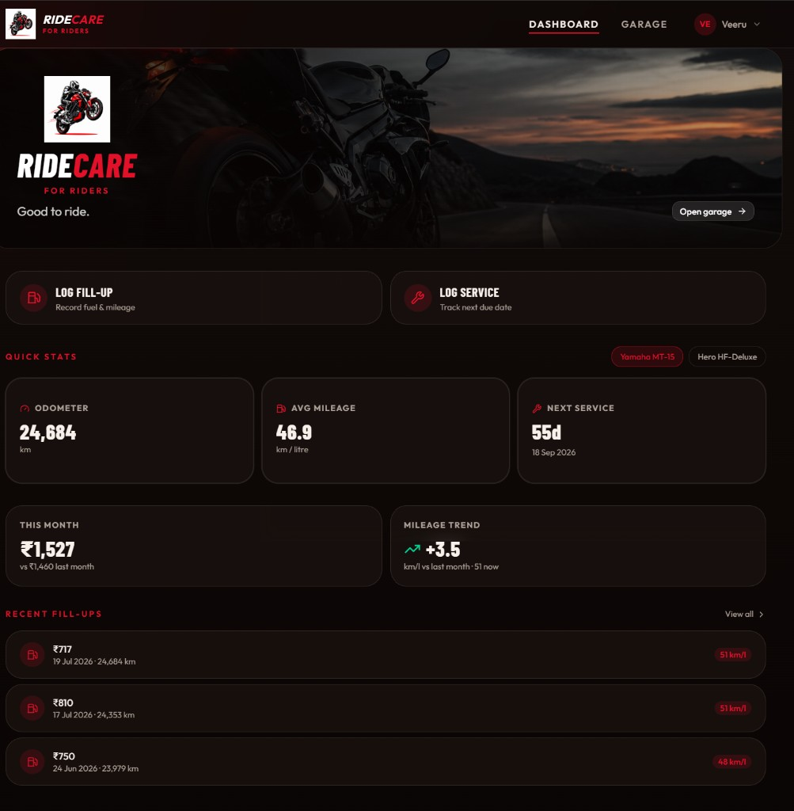
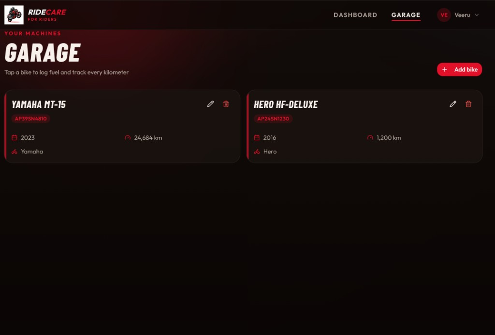
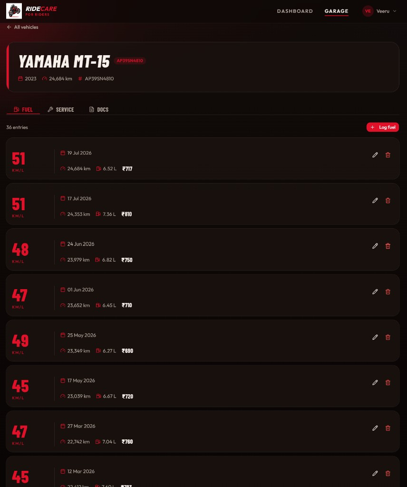
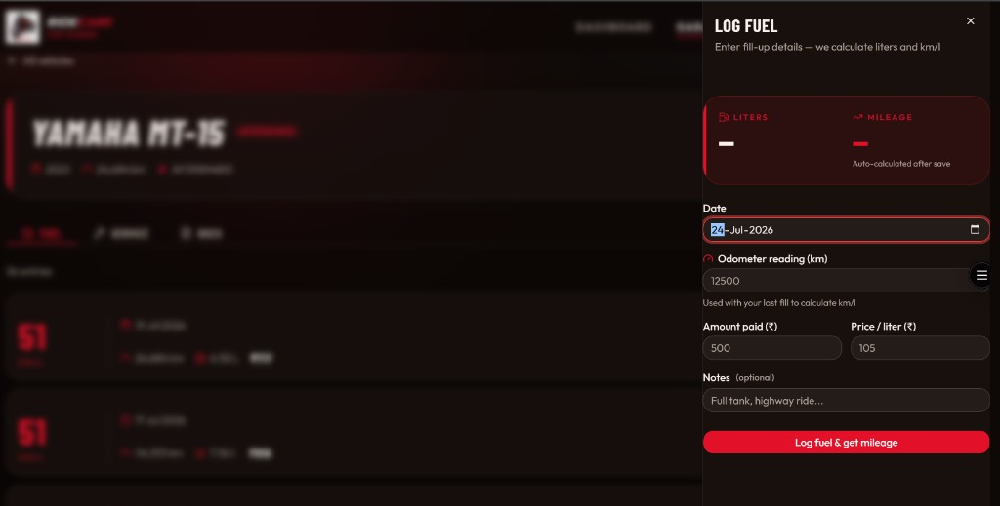
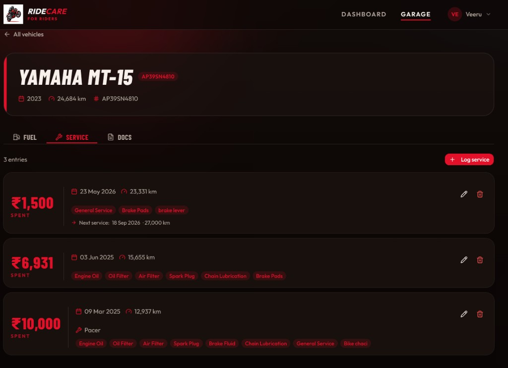
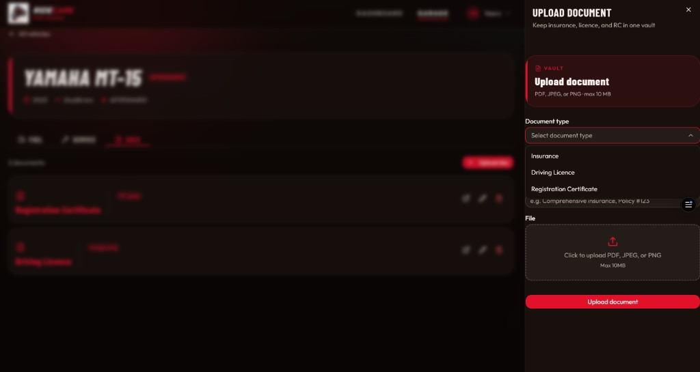
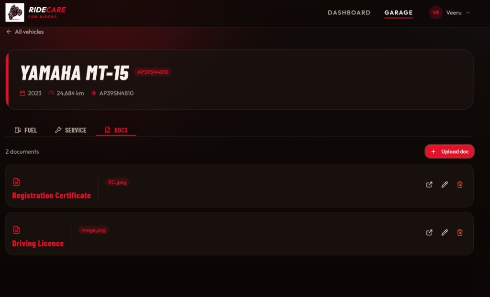

<p align="center">
  
</p>

<h1 align="center">RideCare</h1>

<p align="center">
  <strong>Fuel. Service. Documents. One garage for every rider.</strong>
</p>

<p align="center">
  A backend-first vehicle companion — FastAPI + PostgreSQL power the logic;<br/>
  a dark, rider-focused React UI puts mileage, spend, and paperwork in one place.
</p>

<p align="center">
  
  
  
  
  
  
</p>

---

## Why RideCare

Most “garage apps” are thin CRUD wrappers. RideCare puts **domain logic on the server**:

| On the API | Why it matters |
|------------|----------------|
| Auto liters + km/L from cost, price/L, and odometer deltas | Mileage is computed, not guessed in the UI |
| Timeline-aware odometer validation + full recalculation on edit/delete | History stays consistent when riders fix past fill-ups |
| Live odometer = max(baseline, fuel, service) | Dashboard always shows the real highest reading |
| Cursor pagination (`items`, `next_cursor`, `has_more`, `total`) | List endpoints stay bounded as logs grow |
| JWT + refresh tokens in Redis, rate limiting | Auth is production-shaped, not demo-only |
| Document vault with typed uploads + signed URLs | RC / licence / insurance never live as public blobs |

The frontend stays a thin client: forms, sheets, and dashboards that consume a well-designed REST API.

---

## Product tour

### Dashboard — ride status at a glance
Multi-bike picker, odometer, average mileage, next-service countdown, monthly spend, and mileage trend — with deep links into Log fill-up / Log service.



### Garage — every machine in one place
Add, edit, and open bikes. Registration badge, year, and live kilometers on each card.



### Fuel — mileage as the headline metric
Chronological fill-ups with date, odometer, liters, and cost. km/L is calculated server-side after each save.





### Service — history + next due
Cost, odometer, tagged jobs (oil, filters, brakes…), and next service date / km reminders.



### Docs — digital vault
Insurance, driving licence, and RC — PDF / JPEG / PNG, max 10 MB, with signed download URLs.





---

## Architecture

```
┌─────────────────┐     JWT + refresh      ┌──────────────────────────────┐
│  React + Vite   │ ◄────────────────────► │  FastAPI (async)             │
│  TanStack Query │      REST / JSON       │  routes · schemas · services │
│  Zustand auth   │                        └──────────────┬───────────────┘
└─────────────────┘                                       │
                    ┌─────────────────────────────────────┼─────────────────┐
                    │                     │               │                 │
                    ▼                     ▼               ▼                 ▼
             PostgreSQL              Redis            Supabase         Alembic
             (Supabase)            (Upstash)          Storage         migrations
             users · vehicles      refresh tokens     document files
             fuel · service        rate limits
             documents
```

**Ownership model:** every fuel / service / document row is scoped by `vehicle_id`, and vehicles are scoped by `owner_id`. Routes verify ownership before any mutation.

---

## Tech stack

| Layer | Choices |
|-------|---------|
| API | FastAPI, Pydantic v2, SQLAlchemy 2 (async), Alembic |
| Data | PostgreSQL (Supabase), Redis (Upstash) |
| Files | Supabase Storage + signed URLs |
| Auth | bcrypt passwords, JWT access + refresh rotation |
| UI | React 19, TypeScript, Vite 8, Tailwind CSS v4, shadcn/ui |
| Client data | TanStack Query, Zustand, Axios, Zod + React Hook Form |
| Quality | pytest (async API suite), oxlint, GitHub Actions CI |

---

## Explore the codebase

| Start here | What you’ll see |
|------------|-----------------|
| [`backend/app/routes/`](backend/app/routes/) | Auth, users, vehicles, fuel, service, documents |
| [`backend/app/utils/pagination.py`](backend/app/utils/pagination.py) | Shared cursor paginator |
| [`backend/app/routes/fuel_logs.py`](backend/app/routes/fuel_logs.py) | Mileage recalculation + odometer rules |
| [`backend/app/routes/vehicles.py`](backend/app/routes/vehicles.py) | Baseline vs live odometer |
| [`backend/tests/`](backend/tests/) | Auth, CRUD, pagination, ownership edge cases |
| [`frontend/src/features/`](frontend/src/features/) | Feature modules (api · hooks · forms · cards) |
| [`frontend/src/pages/`](frontend/src/pages/) | Dashboard, garage, vehicle detail, settings |
| [`ROADMAP.md`](ROADMAP.md) | Shipped work and what’s next |

```
RideCare/
├── backend/
│   ├── app/
│   │   ├── models/          # SQLAlchemy entities + mixins
│   │   ├── routes/          # HTTP surface
│   │   ├── schemas/         # Pydantic request/response (incl. CursorPage)
│   │   └── utils/           # JWT, Redis, storage, pagination, rate limits
│   ├── migrations/          # Alembic
│   ├── tests/               # Isolated .env.test + fixtures
│   └── main.py
├── frontend/
│   ├── src/
│   │   ├── api/             # Axios clients per domain
│   │   ├── features/        # auth · vehicles · fuel · service · documents · users
│   │   ├── pages/           # Route-level screens
│   │   ├── store/           # Zustand auth
│   │   └── lib/             # axios interceptors, query client, dates
│   └── public/
├── docs/screenshots/        # Product captures used in this README
└── .github/workflows/       # CI
```

---

## API map

Interactive docs when the API is running: **[http://localhost:8000/docs](http://localhost:8000/docs)**

| Module | Surface | Backend highlights |
|--------|---------|--------------------|
| **Auth** | `POST /auth/register` · `login` · `token` · `refresh` · `logout` | Password policy, refresh in Redis, Swagger OAuth2 form |
| **Users** | `GET/PATCH /users/me` · `PATCH /users/me/password` | Profile + password change |
| **Vehicles** | CRUD `/vehicles/` | Cursor page; live odometer aggregation |
| **Fuel** | CRUD `/fuel_logs/?vehicle_id=` | Liters + km/L; cascade recalc on edit/delete |
| **Service** | CRUD `/service_logs/` · `GET …/next` | Next-due helper for dashboard reminders |
| **Documents** | Multipart CRUD `/documents/` | Type enum, 10 MB cap, signed URLs |

Vehicle-scoped routes require `Authorization: Bearer <access_token>` and `vehicle_id` where noted. List endpoints for vehicles, fuel, and service return:

```json
{
  "items": [ /* … */ ],
  "next_cursor": "… or null",
  "has_more": false,
  "total": 36
}
```

---

## Quick start

### Backend

```bash
cd backend
python -m venv .venv

# Windows
.venv\Scripts\activate
# macOS / Linux
source .venv/bin/activate

pip install -r requirements.txt
cp .env.example .env   # DATABASE_URL, JWT, Supabase, Redis, ALLOWED_ORIGINS
alembic upgrade head
uvicorn main:app --reload
```

- Health: [http://localhost:8000/health](http://localhost:8000/health)
- OpenAPI: [http://localhost:8000/docs](http://localhost:8000/docs)

**Swagger auth:** register/login with JSON, or use **Authorize** via `POST /auth/token` (username = email).

### Frontend

```bash
cd frontend
npm install
cp .env.example .env   # VITE_API_URL=http://localhost:8000
npm run dev
```

App: [http://localhost:5173](http://localhost:5173)

```bash
npm run build    # production bundle
npm run lint     # oxlint
```

### Tests

Tests hit a **separate** Supabase project via `backend/.env.test` (never commit it).

```bash
# Apply migrations to the test DB once (swap env files carefully)
cp .env .env.backup && cp .env.test .env
alembic upgrade head
cp .env.backup .env

pytest tests/ -v
```

CI runs the same suite with repository secrets (see `.github/workflows/`).

---

## Environment

| File | Role | Commit? |
|------|------|---------|
| `backend/.env` | Dev DB, JWT, Supabase, Redis | No |
| `backend/.env.test` | Pytest isolation | No |
| `backend/.env.example` | Required keys template | Yes |
| `frontend/.env` | Local `VITE_API_URL` | No |
| `frontend/.env.example` / `.env.production` | API URL templates | Yes (no secrets) |

---

## What “done” looks like

- Auth (register, login, refresh, logout) + profile settings  
- Multi-vehicle garage with ownership checks  
- Fuel logging with server-side mileage math and validation  
- Service history + next-service API for reminders  
- Document vault (upload / replace / signed view / delete)  
- Dashboard insights (spend, trend, service soon/overdue)  
- Cursor pagination on list APIs  
- Automated backend tests + GitHub Actions  

See [ROADMAP.md](ROADMAP.md) for planned follow-ups.

---

<p align="center">
  <sub>Built for riders who want numbers they can trust — and an API recruiters can read.</sub>
</p>
