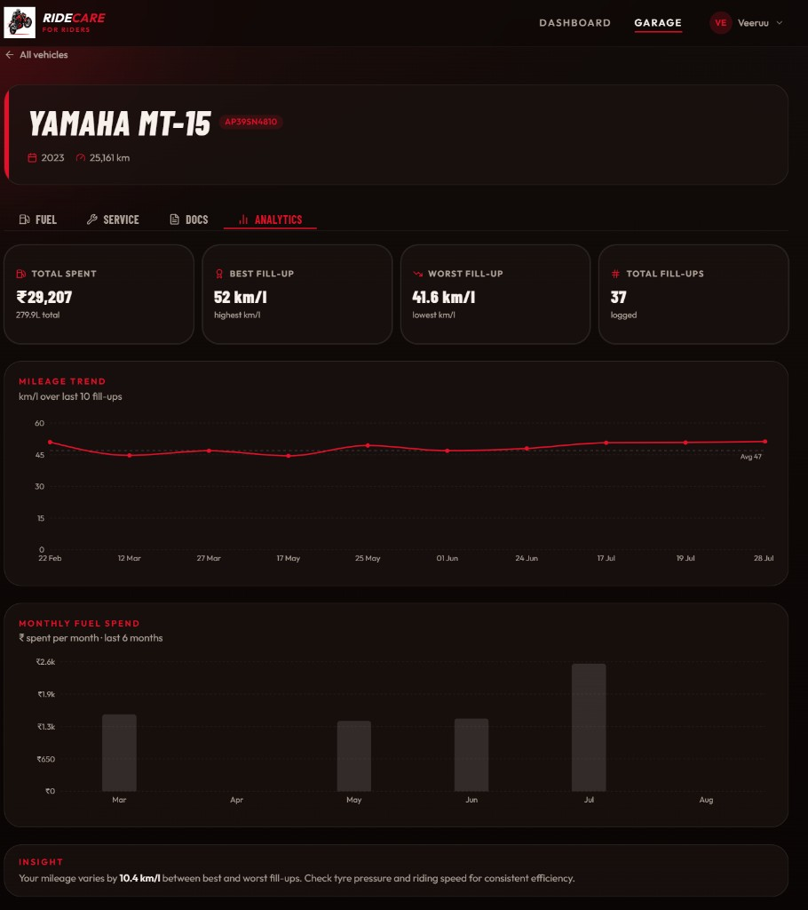
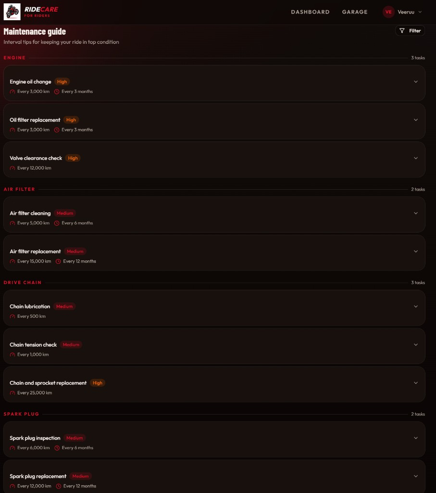
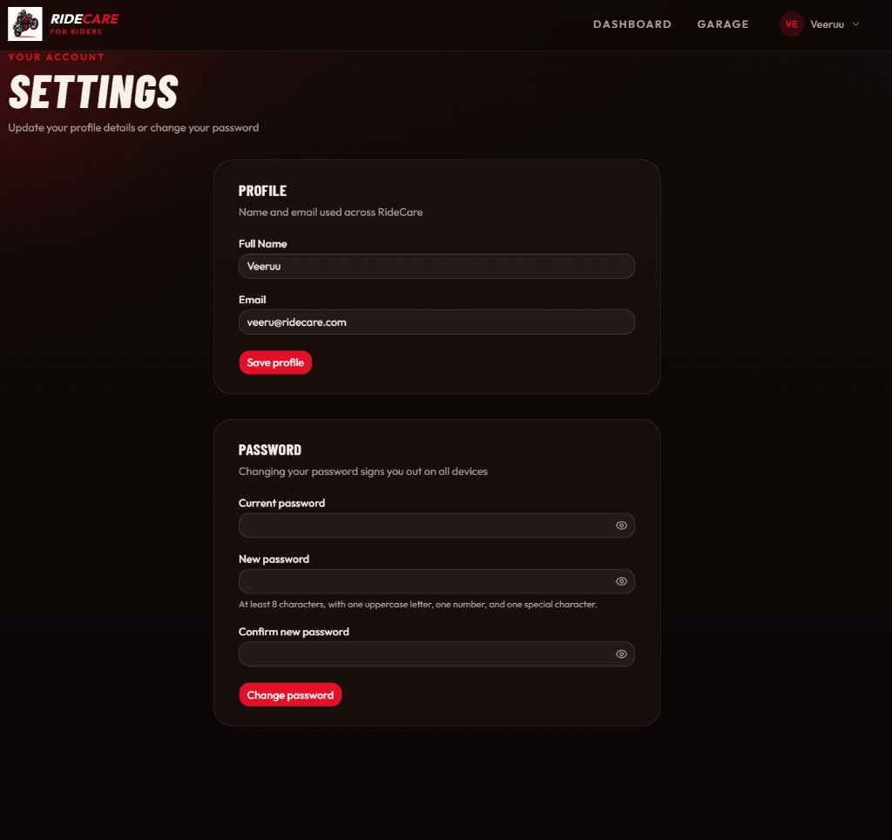

<p align="center">
  
</p>

<h1 align="center">RideCare</h1>

<p align="center">
  <strong>Fuel. Service. Documents. Guides. Analytics.<br/>One garage for every rider.</strong>
</p>

<p align="center">
  <a href="https://ride-care-jade.vercel.app"><strong>Live app</strong></a>
  ·
  <a href="https://ride-care.onrender.com/docs">API docs</a>
</p>

<p align="center">
  A backend-first vehicle companion — domain logic lives in FastAPI + PostgreSQL;<br/>
  a dark React UI surfaces mileage, spend, paperwork, and charts you can trust.
</p>

<p align="center">
  <a href="https://ride-care-jade.vercel.app"></a>
  <a href="https://ride-care.onrender.com/docs"></a>
  
  
  
  
  
  
</p>

---

## Why RideCare

Most garage apps are thin CRUD. RideCare keeps **truth on the server**:

| Capability | What the API owns |
|------------|-------------------|
| Mileage math | Liters + km/L from cost, price/L, and odometer deltas — recalculated on every edit/delete |
| Live odometer | `max(baseline, fuel, service)` so the dashboard never lies |
| Dashboard aggregates | `GET /vehicles/{id}/summary` scans **all** logs, not one UI page |
| Charts | `GET /vehicles/{id}/analytics` returns SQL-ready trend + monthly spend series |
| Scale | Cursor pagination (`items`, `next_cursor`, `has_more`, `total`) |
| Speed | Redis cache with write-through invalidation on summary, analytics, list, detail, next-service |
| Auth | httpOnly cookie JWT + refresh rotation in Redis, rate limiting, session revoke on password change |
| Docs | Typed vault uploads with signed URLs — never public blobs |
| Guidelines | File-backed maintenance catalog (in-memory), filterable without a DB table |

The frontend stays thin: forms, sheets, charts, and dashboards over a clear REST API.

---

## Product tour

### Dashboard — status at a glance
Multi-bike picker, odometer, average mileage, next-service countdown, monthly spend, and mileage trend — all from the summary API.


### Garage — every machine in one place
Add, edit, and open bikes. Registration, year, and live kilometers on each card.


### Fuel — mileage as the headline
Chronological fill-ups with date, odometer, liters, and cost. km/L is calculated server-side. **Load more** via cursor pages.


### Service — history + next due
Cost, odometer, tagged jobs, and next service date / km reminders.


### Docs — digital vault
Insurance, driving licence, and RC — PDF / JPEG / PNG, max 10 MB, signed downloads.


### Analytics — spend and mileage charts
Per-vehicle Analytics tab (Recharts): summary cards, last-10 mileage trend, last-6 months fuel spend — from `GET /vehicles/{id}/analytics`.



### Maintenance guide — interval tips
Oil, chain, brakes, tyres, CVT… filterable by component and severity from a static JSON catalog.



### Settings — profile and password
Update name/email or change password (revokes all sessions).



---

## Architecture

```
┌─────────────────┐     JWT + refresh      ┌──────────────────────────────┐
│  React + Vite   │ ◄────────────────────► │  FastAPI (async)             │
│  TanStack Query │      REST / JSON       │  routes · schemas · services │
│  Zustand auth   │                        └──────────────┬───────────────┘
└─────────────────┘                                       │
                    ┌─────────────────────────────────────┼─────────────────┐
                    │                     │               │                 │
                    ▼                     ▼               ▼                 ▼
             PostgreSQL              Redis            Supabase         Alembic
             (Supabase)            (Upstash)          Storage         migrations
             users · vehicles      refresh tokens     document files
             fuel · service        rate limits
             documents             response cache
```

Every fuel / service / document row is scoped by `vehicle_id`; vehicles by `owner_id`. Routes verify ownership before mutations.

---

## Tech stack

| Layer | Choices |
|-------|---------|
| API | FastAPI, Pydantic v2, SQLAlchemy 2 (async), Alembic |
| Data | PostgreSQL (Supabase), Redis (Upstash) |
| Files | Supabase Storage + signed URLs |
| Auth | bcrypt, JWT access + refresh rotation |
| UI | React 19, TypeScript, Vite 8, Tailwind CSS v4, shadcn/ui, Recharts |
| Client | TanStack Query, Zustand, Axios, Zod + React Hook Form |
| Quality | pytest (async API suite), oxlint, GitHub Actions CI |

---

## API map

Live docs: **[https://ride-care.onrender.com/docs](https://ride-care.onrender.com/docs)** · local: [http://localhost:8000/docs](http://localhost:8000/docs)

| Module | Surface | Highlights |
|--------|---------|------------|
| **Auth** | `register` · `login` · `token` · `refresh` · `logout` | httpOnly cookies; Swagger OAuth2 form still returns bearer body |
| **Users** | `GET/PATCH /users/me` · password change | Session revoke on password change |
| **Vehicles** | CRUD · `…/summary` · `…/analytics` | Live odometer; Redis-cached reads |
| **Fuel** | CRUD `/fuel_logs/?vehicle_id=` | Liters + km/L; cascade recalc; cache invalidation |
| **Service** | CRUD · `GET …/next` | Next-due helper; cached |
| **Documents** | Multipart CRUD | Type enum, 10 MB, signed URLs |
| **Guidelines** | `/maintenance-guidelines/` + filters | JSON file + in-memory cache |

List responses use a shared cursor page:

```json
{
  "items": [],
  "next_cursor": null,
  "has_more": false,
  "total": 36
}
```

---

## Explore the code

| Start here | What you’ll see |
|------------|-----------------|
| [`backend/app/routes/vehicles.py`](backend/app/routes/vehicles.py) | Summary, analytics, live odometer, Redis-cached reads |
| [`backend/app/routes/fuel_logs.py`](backend/app/routes/fuel_logs.py) | Mileage recalculation + odometer rules |
| [`backend/app/utils/cache.py`](backend/app/utils/cache.py) | Cache helpers + key builders |
| [`backend/app/utils/pagination.py`](backend/app/utils/pagination.py) | Shared cursor paginator |
| [`backend/data/maintenance_guidelines.json`](backend/data/maintenance_guidelines.json) | Guideline catalog |
| [`backend/tests/`](backend/tests/) | Auth, CRUD, pagination, cache, summary, analytics, guidelines |
| [`frontend/src/features/`](frontend/src/features/) | Domain modules (hooks · forms · charts) |
| [`frontend/src/pages/`](frontend/src/pages/) | Dashboard, garage, detail, settings, maintenance |
| [`ROADMAP.md`](ROADMAP.md) | Shipped vs next |

```
RideCare/
├── backend/          # FastAPI · models · routes · Redis · tests
├── frontend/         # React app (api · features · pages)
├── docs/screenshots/ # Product captures
└── .github/workflows/
```

---

## Quick start

### Backend

```bash
cd backend
python -m venv .venv

# Windows
.venv\Scripts\activate
# macOS / Linux
source .venv/bin/activate

pip install -r requirements.txt
cp .env.example .env   # DATABASE_URL, JWT, Supabase, Redis, ALLOWED_ORIGINS
alembic upgrade head
uvicorn main:app --reload
```

- Health: [http://localhost:8000/health](http://localhost:8000/health)
- OpenAPI: [http://localhost:8000/docs](http://localhost:8000/docs)

### Frontend

```bash
cd frontend
npm install
cp .env.example .env   # VITE_API_URL=http://localhost:8000
npm run dev
```

App: [http://localhost:5173](http://localhost:5173)

### Tests

Tests use a **separate** Supabase project via `backend/.env.test` (never commit it).

```bash
.\.venv\Scripts\python.exe -m pytest tests/ -v
```

---

## Environment

| File | Role | Commit? |
|------|------|---------|
| `backend/.env` | Dev DB, JWT, Supabase, Redis | No |
| `backend/.env.test` | Pytest isolation | No |
| `backend/.env.example` | Required keys template | Yes |
| `frontend/.env` | Local `VITE_API_URL` | No |
| `frontend/.env.example` / `.env.production` | API URL templates | Yes |

---

## Shipped today

Auth · multi-vehicle garage · server-side mileage · service reminders · document vault · summary dashboard · analytics charts · maintenance guide · cursor pagination · Redis caching · CI + production deploy

What’s next → [ROADMAP.md](ROADMAP.md)

---

<p align="center">
  <sub>Built for riders who want numbers they can trust — and an API recruiters can read.</sub>
</p>
